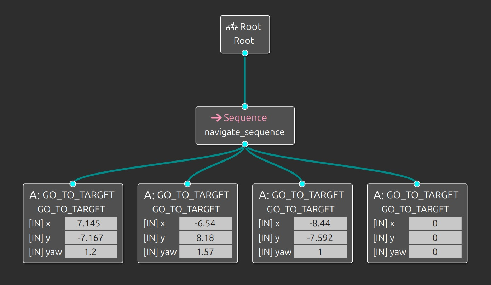

# Autonomous robot simulation using ROS 2 Jazzy, Nav2, and Behavior Tree structure in Gazebo.

## A. Deskripsi Proyek
Project ini bertujuan untuk mendemonstrasikan kemampuan robot dalam bernavigasi secara otonom menggunakan framework **ROS 2 Navigation Stack (Nav2)**. Logika kontrol utama diatur menggunakan **Behavior Tree**, yang memungkinkan robot untuk mengeksekusi tugas navigasi yang kompleks secara modular dan terstruktur.

Robot akan melakukan lokalisasi menggunakan AMCL dan merencanakan jalur (path planning) untuk mencapai serangkaian *waypoints* (titik target).

## B. Arsitektur Behavoir Tree
Logika navigasi robot dibangun menggunakan struktur Behavior Tree sederhana namun efektif.

#### Penjelasan Node:
1.  **Root**: Titik awal eksekusi tree.
2.  **Sequence (`navigate_sequence`)**: Node kontrol tipe *Sequence*. Node ini akan mengeksekusi anak-anaknya (target points) secara berurutan dari kiri ke kanan. Jika salah satu target gagal dicapai, seluruh sequence akan berhenti (return FAILURE). Jika berhasil, ia lanjut ke target berikutnya.
3.  **Action Nodes (`GO_TO_TARGET`)**: Terdapat 4 node aksi yang berisi koordinat tujuan robot.

#### Daftar Target Point (Waypoints):

| Urutan | Node Name | Posisi X | Posisi Y | Yaw (Orientasi) |
| :--- | :--- | :--- | :--- | :--- |
| 1 | `GO_TO_TARGET` | **7.145** | **-7.167** | 1.2 rad |
| 2 | `GO_TO_TARGET` | **-6.54** | **8.18** | 1.57 rad |
| 3 | `GO_TO_TARGET` | **-8.44** | **-7.592** | 1.0 rad |
| 4 | `GO_TO_TARGET` | **0.0** | **0.0** | 0.0 rad |

## C. Persyaratan
Sebelum menjalankan simulasi, pastikan sistem Anda telah terinstall:
* **OS**: Ubuntu 24.04 / 22.04
* **ROS 2**: Jazzy
* **Simulator**: Gazebo Harmonic
* **Dependencies**:
    * `navigation2`
    * `nav2_bringup`
    * `behaviortree_cpp_v3`

Install dependencies yang diperlukan:
```bash
sudo apt update
sudo apt install ros-$ROS_DISTRO-navigation2 ros-$ROS_DISTRO-nav2-bringup ros-$ROS_DISTRO-gazebo-ros-pkgs
```
## D. Instalasi
1. Clone Repositori ini:
   ```bash
    git clone https://github.com/RIBFLI/BehaviorTree-Cpp-Gazebo-Simulation-ROS2.git
    cd src\nav2_mobile_robot
    git clone https://github.com/RIBFLI/nav2_mobile_robot.git
    ```
2. Build Workspace:
   ```bash
    colcon build
    source /opt/ros/jazzy/setup.bash
    ```
3. Source Setup:
   ```bash
    source install/setup.bash
    ```
## E. Cara Menjalankan (Usage)
Untuk menjalankan simulasi robot patrol, jalankan perintah berikut pada terminal yang berbeda (jangan lupa source install/setup.bash di setiap terminal):
1. Launch Simulasi Gazebo:
   ```bash
    ros2 launch nav2_mobile_robot gazebo.launch.py
    ```
2. Launch Visualisasi (RViz):
   ```bash
    ros2 launch nav2_mobile_robot display.launch.py
    ```
3. Launch Lokalisasi (AMCL):
   ```bash
    ros2 launch nav2_mobile_robot amcl.launch.py
    ```
4. Launch Navigasi (Nav2):
   ```bash
    ros2 launch nav2_mobile_robot navigation.launch.py
    ```
5. Jalankan Eksekutor Behavior Tree:
   ```bash
    ros2 run turtle_control_pkg turtle_control
    ```
# 👨‍💻 Author
- [Muhammad Ribfli] Mahasiswa Teknik Robotika - Politeknik Negeri Batam
- Mata Kuliah: RE703 - Kendali Robotika
- NIM [4222201014] 
-------------------------------------------------------------------------------
- [Fitria Salsabillah] Mahasiswa Teknik Robotika - Politeknik Negeri Batam
- Mata Kuliah: RE703 - Kendali Robotika
- NIM [4222201034] 


